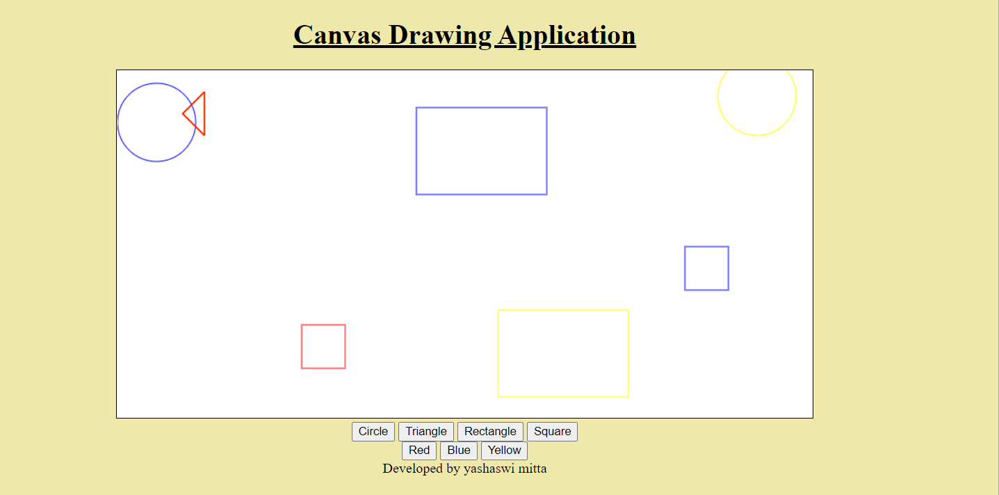

# Web Page for Paint Application

## AIM:

To design a static website for Paint Application using HTML5 canvas.

## DESIGN STEPS:

### Step 1:

Requirement collection.

### Step 2:

Creating the layout using HTML,CSS and canvas.

### Step 3:

Write javascript to capture move events.

### Step 4:

Perform the drawing operation based on the user input.

### Step 5:

Validate the layout in various browsers.

### Step 6:

Validate the HTML code.

### Step 6:

Publish the website in the given URL.

## PROGRAM :
~~~
<!DOCTYPE html>
<html lang="en">
<head>
    <meta charset="UTF-8">
    <meta http-equiv="X-UA-Compatible" content="IE=edge">
    <meta name="viewport" content="width=device-width, initial-scale=1.0">
    <title>Canvas Application</title>
    

</head>
<body>
    

        <h1><u>Canvas Drawing Application</u></h1>
    <canvas id="myCanvas" width="800" height="400" style="border:1px solid #000000"></canvas>
    

        <input type="button" id="circle" value="Circle">
        <input type="button" id="line" value="Triangle">
        <input type="button" id="rectangle" value="Rectangle">
        <input type="button" id="square" value="Square">
        
    

    

        <input type="button" id="red" value="Red">
        <input type="button" id="blue" value="Blue">
        <input type="button" id="yellow" value="Yellow">
    

        
        

          Developed by yashaswi mitta
        

</body>
</html>
~~~

## OUTPUT:

## Result:

Thus a website is designed and validated for paint application using HTML5 canvas.
